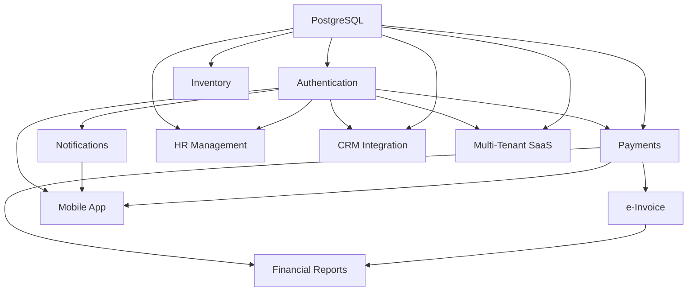

# Ada Maritime AI - Gelecek Özellikler Yol Haritası
## Future Features Roadmap

**Versiyon:** 2.0
**Son Güncelleme:** 13 Kasım 2025
**Doküman Sahibi:** Ada Maritime AI Development Team

---

## İçindekiler (Table of Contents)

1. [Özet (Executive Summary)](#özet-executive-summary)
2. [Mevcut Durum Analizi](#mevcut-durum-analizi)
3. [Özellik Değerlendirmesi](#özellik-değerlendirmesi)
4. [Uygulama Fazları](#uygulama-fazları)
5. [Detaylı Özellik Spesifikasyonları](#detaylı-özellik-spesifikasyonları)
6. [Teknik Mimari](#teknik-mimari)
7. [Risk Analizi](#risk-analizi)
8. [Başarı Metrikleri](#başarı-metrikleri)

---

## Özet (Executive Summary)

Ada Maritime AI, Akdeniz bölgesindeki 13 marina ve 7,000+ rıhtımı yöneten kapsamlı bir marina yönetim sistemidir. Bu yol haritası belgesi, sistemin SaaS platformuna dönüşümü ve kurumsal özelliklerin eklenmesi için stratejik planı içermektedir.

### Önerilen Geliştirme Süreleri
- **Faz 1 (Temel Altyapı):** 8-10 hafta
- **Faz 2 (Kurumsal Özellikler):** 12-14 hafta
- **Faz 3 (İleri Entegrasyonlar):** 10-12 hafta
- **Faz 4 (Mobil & SaaS):** 14-16 hafta

**Toplam Tahmini Süre:** 10-12 ay (44-52 hafta)

---

## Mevcut Durum Analizi

### ✅ Tamamlanmış Özellikler

| Özellik | Durum | Notlar |
|---------|-------|--------|
| **PostgreSQL Veritabanı** | ✅ Kısmen Tamamlandı | Docker Compose'da yapılandırıldı, soyut interface mevcut |
| **REST API (FastAPI)** | ✅ Tamamlandı | Kapsamlı API endpoints (insurance, permits, compliance, violations) |
| **Multi-Region Yönetimi** | ✅ Tamamlandı | 13 marina, 4 ülke, 5 para birimi desteği |
| **Compliance Sistemi** | ✅ Tamamlandı | 176-maddelik düzenleme çerçevesi (VERIFY Agent) |
| **Real-time Observability** | ✅ Tamamlandı | Vue 3 dashboard, WebSocket, SQLite event store |
| **Big-5 Orchestrator** | ✅ Tamamlandı | 15 operasyonel skill ile AI-tabanlı orkestrasyon |

### 🔄 Kısmen Tamamlanmış Özellikler

| Özellik | Tamamlanma % | Eksik Bileşenler |
|---------|--------------|------------------|
| **PostgreSQL Entegrasyonu** | 40% | Migrasyon scriptleri, production ORM, connection pooling |
| **WebSocket Bildirimleri** | 30% | Observability için var, genel amaçlı notification sistemi yok |
| **Raporlama** | 25% | Analytics skill var, finansal raporlama modülü eksik |

### ❌ Eksik Özellikler

- Kullanıcı kimlik doğrulama ve yetkilendirme (OAuth2, JWT, RBAC)
- Ödeme sistemi entegrasyonu (Stripe, iyzico, PayPal)
- Mobil uygulama (React Native)
- CRM entegrasyonu (Salesforce, HubSpot, Zoho)
- Finansal raporlama modülü (kar-zarar, gelir tabloları, tahsilat)
- Envanter yönetimi (ekipman, malzeme, yakıt, su)
- Personel yönetimi (vardiya, maaş bordro, performans)
- Otomatik e-fatura (e-Arşiv, e-Fatura, GİB entegrasyonu)

---

## Özellik Değerlendirmesi

### Önceliklendirme Matrisi

Her özellik aşağıdaki kriterlere göre değerlendirilmiştir:
- **İş Değeri (Business Value):** 1-5 (5 = En yüksek)
- **Teknik Karmaşıklık (Technical Complexity):** 1-5 (5 = En karmaşık)
- **Bağımlılıklar (Dependencies):** Diğer özelliklere bağımlılık sayısı
- **Risk Seviyesi (Risk Level):** Düşük, Orta, Yüksek

| Özellik | İş Değeri | Karmaşıklık | Bağımlılıklar | Risk | Öncelik Skoru |
|---------|-----------|-------------|---------------|------|---------------|
| **Kullanıcı Kimlik Doğrulama** | 5 | 3 | 0 | Orta | **YÜKSEK** (P0) |
| **PostgreSQL Prod Entegrasyonu** | 5 | 2 | 0 | Düşük | **YÜKSEK** (P0) |
| **Ödeme Sistemi** | 5 | 4 | 1 (Auth) | Yüksek | **YÜKSEK** (P1) |
| **Finansal Raporlama** | 4 | 3 | 2 (DB, Payment) | Orta | **ORTA** (P1) |
| **Real-time Bildirimler** | 4 | 2 | 1 (Auth) | Düşük | **ORTA** (P1) |
| **Otomatik e-Fatura** | 5 | 4 | 3 (DB, Payment, Auth) | Yüksek | **ORTA** (P2) |
| **Envanter Yönetimi** | 3 | 3 | 1 (DB) | Orta | **ORTA** (P2) |
| **Personel Yönetimi** | 4 | 4 | 2 (DB, Auth) | Yüksek | **ORTA** (P2) |
| **CRM Entegrasyonu** | 3 | 3 | 2 (DB, Auth) | Orta | **DÜŞÜK** (P3) |
| **Mobil Uygulama** | 4 | 5 | 4 (Auth, API, Payment, Notifications) | Yüksek | **DÜŞÜK** (P3) |

---

## Uygulama Fazları

### 📦 **FAZ 1: Temel Altyapı & Güvenlik** (8-10 Hafta)

**Hedef:** Güvenli, ölçeklenebilir production-ready temel oluşturmak

#### 1.1 PostgreSQL Production Entegrasyonu
**Süre:** 2-3 hafta
**Bağımlılıklar:** Yok

**Teknik Gereksinimler:**
- SQLAlchemy ORM entegrasyonu (async support)
- Alembic migration framework
- Connection pooling (asyncpg)
- Database indexing stratejisi
- Backup & restore otomasyonu
- Read replica konfigürasyonu (optional)

**Dosyalar:**
```
backend/database/
├── orm/
│   ├── __init__.py
│   ├── base.py              # Declarative base
│   ├── models.py            # SQLAlchemy models
│   └── session.py           # Async session management
├── migrations/
│   ├── alembic.ini
│   ├── env.py
│   └── versions/
│       ├── 001_initial_schema.py
│       ├── 002_add_bookings.py
│       └── 003_compliance_tables.py
└── repositories/
    ├── marina_repository.py
    ├── booking_repository.py
    └── compliance_repository.py
```

**Kabul Kriterleri:**
- [ ] Tüm mevcut mock data PostgreSQL'e migrate edildi
- [ ] Migration scriptleri test edildi (up/down)
- [ ] Connection pool performans testleri geçti (1000+ concurrent connections)
- [ ] Backup scripti çalışıyor (automated daily backups)
- [ ] Monitoring & alerting kuruldu (Prometheus + Grafana)

---

#### 1.2 Kullanıcı Kimlik Doğrulama & Yetkilendirme
**Süre:** 3-4 hafta
**Bağımlılıklar:** PostgreSQL

**Teknik Gereksinimler:**
- OAuth2 + JWT (RFC 7519) implementasyonu
- Role-Based Access Control (RBAC)
- Multi-factor authentication (2FA via TOTP)
- Session management (Redis-backed)
- Password hashing (bcrypt/Argon2)
- API key yönetimi (third-party integrations için)

**Roller & İzinler:**
```python
# Role Hierarchy
ROLES = {
    "super_admin": {
        "description": "Platform yöneticisi (tüm marinalar)",
        "permissions": ["*"]
    },
    "marina_manager": {
        "description": "Marina yöneticisi (tek marina)",
        "permissions": [
            "berth:*", "booking:*", "compliance:read",
            "insurance:read", "permit:approve", "report:read"
        ]
    },
    "marina_staff": {
        "description": "Marina personeli (operasyonel)",
        "permissions": [
            "berth:read", "booking:create", "booking:read",
            "permit:create", "compliance:read"
        ]
    },
    "vessel_owner": {
        "description": "Tekne sahibi (self-service)",
        "permissions": [
            "booking:create", "booking:read:own",
            "insurance:create", "insurance:read:own"
        ]
    },
    "accountant": {
        "description": "Mali işler (raporlama)",
        "permissions": [
            "report:*", "payment:read", "invoice:*"
        ]
    },
    "auditor": {
        "description": "Denetçi (read-only)",
        "permissions": [
            "compliance:read", "violation:read", "audit:read"
        ]
    }
}
```

**API Endpoints:**
```
POST   /api/v1/auth/register              # Yeni kullanıcı kaydı
POST   /api/v1/auth/login                 # JWT token alma
POST   /api/v1/auth/refresh               # Token yenileme
POST   /api/v1/auth/logout                # Session sonlandırma
POST   /api/v1/auth/password/reset        # Şifre sıfırlama isteği
POST   /api/v1/auth/password/change       # Şifre değiştirme
POST   /api/v1/auth/2fa/enable            # 2FA aktivasyonu
POST   /api/v1/auth/2fa/verify            # 2FA doğrulama
GET    /api/v1/auth/me                    # Kullanıcı profili
PUT    /api/v1/auth/me                    # Profil güncelleme

# Admin endpoints
GET    /api/v1/admin/users                # Tüm kullanıcılar
POST   /api/v1/admin/users/{id}/role      # Rol atama
DELETE /api/v1/admin/users/{id}           # Kullanıcı silme
GET    /api/v1/admin/roles                # Tüm roller
POST   /api/v1/admin/roles                # Yeni rol oluşturma
```

**Dosyalar:**
```
backend/auth/
├── __init__.py
├── models.py                # User, Role, Permission models
├── schemas.py               # Pydantic request/response models
├── security.py              # Password hashing, JWT utilities
├── dependencies.py          # FastAPI dependencies (get_current_user)
├── oauth2.py                # OAuth2 flow implementation
├── rbac.py                  # Role-based access control logic
├── two_factor.py            # TOTP 2FA implementation
└── middleware.py            # Authentication middleware
```

**Kabul Kriterleri:**
- [ ] JWT token generation/validation çalışıyor
- [ ] RBAC sistemi test edildi (tüm roller)
- [ ] 2FA implementasyonu çalışıyor (QR code + TOTP)
- [ ] Rate limiting aktif (brute force koruması)
- [ ] Session management çalışıyor (Redis-backed)
- [ ] Security audit geçti (OWASP Top 10 kontrolleri)

---

#### 1.3 Gerçek Zamanlı Bildirim Sistemi
**Süre:** 2-3 hafta
**Bağımlılıklar:** Authentication

**Teknik Gereksinimler:**
- WebSocket server (FastAPI WebSocket support)
- Redis Pub/Sub (message broker)
- Notification templating engine
- Multi-channel delivery (WebSocket, Email, SMS, Push)
- Notification preferences (per user)
- Delivery tracking & retry logic

**Bildirim Tipleri:**
```python
NOTIFICATION_TYPES = {
    # Booking notifications
    "booking.confirmed": {
        "channels": ["websocket", "email"],
        "priority": "high",
        "template": "booking_confirmation"
    },
    "booking.cancelled": {
        "channels": ["websocket", "email", "sms"],
        "priority": "high",
        "template": "booking_cancellation"
    },
    "booking.checkin_reminder": {
        "channels": ["email", "sms"],
        "priority": "medium",
        "template": "checkin_reminder"
    },

    # Compliance notifications
    "compliance.violation_detected": {
        "channels": ["websocket", "email"],
        "priority": "critical",
        "template": "violation_alert"
    },
    "compliance.insurance_expiring": {
        "channels": ["email", "sms"],
        "priority": "high",
        "template": "insurance_expiry"
    },
    "compliance.permit_approved": {
        "channels": ["websocket", "email"],
        "priority": "medium",
        "template": "permit_approval"
    },

    # Payment notifications
    "payment.received": {
        "channels": ["websocket", "email"],
        "priority": "high",
        "template": "payment_receipt"
    },
    "payment.failed": {
        "channels": ["websocket", "email", "sms"],
        "priority": "critical",
        "template": "payment_failure"
    },

    # System notifications
    "system.maintenance": {
        "channels": ["websocket", "email"],
        "priority": "medium",
        "template": "maintenance_notice"
    }
}
```

**API Endpoints:**
```
# WebSocket endpoint
WS     /api/v1/notifications/ws           # WebSocket connection

# REST endpoints
GET    /api/v1/notifications              # Kullanıcı bildirimleri
PUT    /api/v1/notifications/{id}/read    # Bildirim okundu işaretle
DELETE /api/v1/notifications/{id}         # Bildirim sil
GET    /api/v1/notifications/preferences  # Bildirim tercihleri
PUT    /api/v1/notifications/preferences  # Tercihleri güncelle
POST   /api/v1/notifications/test         # Test bildirimi gönder (admin)
```

**Dosyalar:**
```
backend/notifications/
├── __init__.py
├── models.py                # Notification, NotificationPreference models
├── schemas.py               # Pydantic models
├── websocket.py             # WebSocket manager
├── pubsub.py                # Redis Pub/Sub implementation
├── channels/
│   ├── email.py             # Email delivery (SMTP)
│   ├── sms.py               # SMS delivery (Twilio/Vonage)
│   ├── push.py              # Push notifications (Firebase)
│   └── websocket.py         # WebSocket delivery
├── templates/
│   ├── booking_confirmation.html
│   ├── violation_alert.html
│   └── ...
└── delivery.py              # Delivery orchestration & retry logic
```

**Kabul Kriterleri:**
- [ ] WebSocket connections stabil (1000+ concurrent)
- [ ] Multi-channel delivery çalışıyor (Email, SMS, Push)
- [ ] Template engine çalışıyor (Türkçe & İngilizce)
- [ ] Notification preferences kaydediliyor
- [ ] Retry logic test edildi (failed deliveries)
- [ ] Load testing geçti (10,000 notifications/minute)

---

### 💰 **FAZ 2: Finansal Sistemler** (12-14 Hafta)

**Hedef:** Ödeme altyapısı, faturalandırma ve finansal raporlama

#### 2.1 Ödeme Sistemi Entegrasyonu
**Süre:** 5-6 hafta
**Bağımlılıklar:** Authentication, PostgreSQL, Notifications

**Desteklenen Ödeme Yöntemleri:**
- **Kredi Kartı:** Stripe, iyzico
- **Banka Transferi (EFT):** Manuel onay sistemi
- **Sanal POS:** Turkish banks (Garanti, İş Bankası, Akbank)
- **Dijital Cüzdanlar:** Apple Pay, Google Pay
- **IBAN:** SEPA transfers (European marinas)

**Teknik Gereksinimler:**
- Multi-gateway architecture (adapter pattern)
- PCI-DSS compliance
- Webhook handling (payment confirmations)
- Refund & chargeback yönetimi
- Currency conversion (5 currencies)
- Payment plan support (installments)
- Invoice generation (automated)

**Ödeme Gateway Mimarisi:**
```python
# Abstract payment gateway interface
class PaymentGateway(ABC):
    @abstractmethod
    async def create_payment_intent(amount, currency, metadata)
    @abstractmethod
    async def confirm_payment(payment_intent_id)
    @abstractmethod
    async def refund_payment(payment_id, amount)
    @abstractmethod
    async def handle_webhook(payload, signature)

# Implementations
class StripeGateway(PaymentGateway):
    # Stripe-specific implementation

class IyzicoGateway(PaymentGateway):
    # iyzico-specific implementation

class BankTransferGateway(PaymentGateway):
    # Manual bank transfer handling
```

**API Endpoints:**
```
# Payment intents
POST   /api/v1/payments/intent            # Ödeme başlatma
POST   /api/v1/payments/confirm           # Ödeme onaylama
GET    /api/v1/payments/{id}              # Ödeme durumu

# Refunds
POST   /api/v1/payments/{id}/refund       # İade işlemi
GET    /api/v1/payments/{id}/refunds      # İade geçmişi

# Payment methods
GET    /api/v1/payments/methods           # Kullanıcı ödeme yöntemleri
POST   /api/v1/payments/methods           # Yeni ödeme yöntemi ekle
DELETE /api/v1/payments/methods/{id}      # Ödeme yöntemi sil

# Webhooks
POST   /api/v1/webhooks/stripe            # Stripe webhook
POST   /api/v1/webhooks/iyzico            # iyzico webhook

# Admin
GET    /api/v1/admin/payments             # Tüm ödemeler
GET    /api/v1/admin/payments/pending     # Bekleyen ödemeler
POST   /api/v1/admin/payments/{id}/approve # Manuel onay
```

**Dosyalar:**
```
backend/payments/
├── __init__.py
├── models.py                # Payment, PaymentMethod, Refund models
├── schemas.py               # Pydantic models
├── gateway.py               # Abstract gateway interface
├── gateways/
│   ├── stripe.py            # Stripe implementation
│   ├── iyzico.py            # iyzico implementation
│   └── bank_transfer.py     # Bank transfer handling
├── webhooks.py              # Webhook handlers
├── currency.py              # Currency conversion logic
└── invoice_generator.py     # PDF invoice generation
```

**Kabul Kriterleri:**
- [ ] Stripe entegrasyonu çalışıyor (card payments)
- [ ] iyzico entegrasyonu çalışıyor (Turkish market)
- [ ] Webhook handling test edildi (all gateways)
- [ ] Refund işlemi çalışıyor
- [ ] Multi-currency support test edildi
- [ ] PCI-DSS compliance doğrulandı
- [ ] Invoice generation çalışıyor (PDF)

---

#### 2.2 Otomatik e-Fatura Sistemi
**Süre:** 4-5 hafta
**Bağımlılıklar:** Payment System, PostgreSQL

**Teknik Gereksinimler:**
- GİB (Gelir İdaresi Başkanlığı) e-Fatura entegrasyonu
- e-Arşiv fatura (individual customers)
- e-İrsaliye (delivery notes)
- XML generation (UBL-TR 1.2 format)
- Digital signature (e-İmza)
- Automated invoice numbering
- Tax calculation (KDV rates)

**e-Fatura Tipleri:**
```python
INVOICE_TYPES = {
    "e_fatura": {
        "description": "Kurumsal müşteriler için e-Fatura",
        "recipient": "businesses",
        "requires": ["tax_id", "gib_registration"],
        "format": "UBL-TR 1.2"
    },
    "e_arsiv": {
        "description": "Bireysel müşteriler için e-Arşiv",
        "recipient": "individuals",
        "requires": ["tc_no or passport"],
        "format": "UBL-TR 1.2"
    },
    "e_irsaliye": {
        "description": "Teslimat belgesi",
        "recipient": "all",
        "requires": ["delivery_address"],
        "format": "UBL-TR 1.2"
    }
}
```

**API Endpoints:**
```
# Invoice generation
POST   /api/v1/invoices/generate          # Manuel fatura oluşturma
GET    /api/v1/invoices/{id}              # Fatura detayı
GET    /api/v1/invoices/{id}/pdf          # PDF indirme
GET    /api/v1/invoices/{id}/xml          # XML indirme

# e-Fatura operations
POST   /api/v1/invoices/{id}/send         # GİB'e gönderme
GET    /api/v1/invoices/{id}/status       # GİB durumu sorgulama
POST   /api/v1/invoices/{id}/cancel       # Fatura iptali

# Queries
GET    /api/v1/invoices                   # Fatura listesi
GET    /api/v1/invoices/search            # Fatura arama
GET    /api/v1/invoices/pending           # Bekleyen faturalar

# Admin
GET    /api/v1/admin/invoices/errors      # Hatalı faturalar
POST   /api/v1/admin/invoices/retry       # Tekrar gönderme
```

**GİB Entegrasyon Akışı:**
```
1. Booking/Payment completed
2. Generate invoice (auto-numbering)
3. Calculate taxes (KDV 1%, 8%, 18%, 20%)
4. Generate UBL-TR XML
5. Sign with e-İmza
6. Send to GİB portal
7. Receive GİB response (UUID)
8. Store status & UUID
9. Send notification to customer
10. Archive invoice (10 years legal requirement)
```

**Dosyalar:**
```
backend/invoicing/
├── __init__.py
├── models.py                # Invoice, InvoiceItem, TaxRate models
├── schemas.py               # Pydantic models
├── generator.py             # Invoice generation logic
├── xml_builder.py           # UBL-TR XML generation
├── gib/
│   ├── client.py            # GİB API client
│   ├── auth.py              # GİB authentication
│   ├── signature.py         # e-İmza integration
│   └── status_checker.py    # Status polling
├── pdf_generator.py         # PDF invoice rendering
├── numbering.py             # Auto-numbering logic
└── tax_calculator.py        # Tax calculation engine
```

**Kabul Kriterleri:**
- [ ] UBL-TR XML generation çalışıyor
- [ ] GİB entegrasyonu test edildi (test environment)
- [ ] e-İmza signing çalışıyor
- [ ] Automated numbering test edildi
- [ ] Tax calculation doğru (tüm KDV oranları)
- [ ] PDF generation çalışıyor (professional template)
- [ ] Status tracking çalışıyor (GİB polling)

---

#### 2.3 Finansal Raporlama Modülü
**Süre:** 3-4 hafta
**Bağımlılıklar:** Payment System, e-Invoice

**Rapor Tipleri:**
```python
FINANCIAL_REPORTS = {
    "revenue": {
        "name": "Gelir Raporu",
        "description": "Dönemsel gelir analizi",
        "metrics": ["total_revenue", "revenue_by_marina", "revenue_by_service"],
        "visualizations": ["line_chart", "bar_chart", "pie_chart"]
    },
    "profit_loss": {
        "name": "Kar-Zarar Tablosu",
        "description": "Gelir-gider karşılaştırması",
        "metrics": ["revenue", "expenses", "net_profit", "profit_margin"],
        "visualizations": ["waterfall_chart", "table"]
    },
    "occupancy": {
        "name": "Doluluk Raporu",
        "description": "Rıhtım kullanım oranları",
        "metrics": ["occupancy_rate", "average_stay_duration", "turnover"],
        "visualizations": ["heatmap", "line_chart"]
    },
    "collections": {
        "name": "Tahsilat Raporu",
        "description": "Ödeme tahsilatları",
        "metrics": ["collected", "pending", "overdue", "collection_rate"],
        "visualizations": ["bar_chart", "table"]
    },
    "tax": {
        "name": "Vergi Raporu",
        "description": "KDV ve diğer vergi hesaplamaları",
        "metrics": ["total_tax", "tax_by_rate", "tax_payable"],
        "visualizations": ["pie_chart", "table"]
    },
    "customer_analytics": {
        "name": "Müşteri Analizi",
        "description": "Müşteri bazlı gelir analizi",
        "metrics": ["customer_lifetime_value", "repeat_rate", "top_customers"],
        "visualizations": ["bar_chart", "table", "scatter_plot"]
    }
}
```

**API Endpoints:**
```
# Report generation
POST   /api/v1/reports/revenue            # Gelir raporu
POST   /api/v1/reports/profit-loss        # Kar-zarar
POST   /api/v1/reports/occupancy          # Doluluk
POST   /api/v1/reports/collections        # Tahsilat
POST   /api/v1/reports/tax                # Vergi
POST   /api/v1/reports/customer-analytics # Müşteri analizi

# Export
GET    /api/v1/reports/{id}/pdf           # PDF export
GET    /api/v1/reports/{id}/excel         # Excel export
GET    /api/v1/reports/{id}/csv           # CSV export

# Scheduled reports
POST   /api/v1/reports/schedule           # Rapor zamanlama
GET    /api/v1/reports/scheduled          # Zamanlanmış raporlar
DELETE /api/v1/reports/scheduled/{id}     # Zamanlamayı iptal et
```

**Dosyalar:**
```
backend/reporting/
├── __init__.py
├── models.py                # Report, ScheduledReport models
├── schemas.py               # Pydantic models
├── generators/
│   ├── revenue.py           # Revenue report generator
│   ├── profit_loss.py       # P&L report generator
│   ├── occupancy.py         # Occupancy report
│   ├── collections.py       # Collections report
│   └── tax.py               # Tax report
├── exporters/
│   ├── pdf.py               # PDF export (ReportLab)
│   ├── excel.py             # Excel export (openpyxl)
│   └── csv.py               # CSV export
├── scheduler.py             # Report scheduling (Celery)
└── visualizations.py        # Chart generation (Plotly)
```

**Kabul Kriterleri:**
- [ ] Tüm rapor tipleri generate ediliyor
- [ ] PDF/Excel/CSV export çalışıyor
- [ ] Visualizations render ediliyor
- [ ] Scheduled reports çalışıyor
- [ ] Multi-marina filtering çalışıyor
- [ ] Performance test geçti (large datasets)

---

### 🏢 **FAZ 3: Kurumsal Özellikler** (10-12 Hafta)

**Hedef:** İç operasyonlar ve dış entegrasyonlar

#### 3.1 Envanter Yönetimi Sistemi
**Süre:** 3-4 hafta
**Bağımlılıklar:** PostgreSQL, Authentication

**Envanter Kategorileri:**
- **Consumables:** Su, elektrik, yakıt, kimyasallar
- **Equipment:** Forklifts, cranes, pumps, tools
- **Spare Parts:** Yedek parçalar, malzemeler
- **Safety Equipment:** Can yelekleri, yangın söndürücüler
- **Office Supplies:** Kırtasiye, yazıcı kartuşları

**Özellikler:**
- Stock level tracking (real-time)
- Automatic reorder points
- Supplier management
- Purchase order generation
- Stock movements (in/out tracking)
- Barcode/QR code scanning
- Multi-warehouse support
- Expiration date tracking

**API Endpoints:**
```
# Inventory items
GET    /api/v1/inventory/items            # Tüm ürünler
POST   /api/v1/inventory/items            # Yeni ürün ekle
PUT    /api/v1/inventory/items/{id}       # Ürün güncelle
DELETE /api/v1/inventory/items/{id}       # Ürün sil

# Stock movements
POST   /api/v1/inventory/movements        # Stok hareketi kaydet
GET    /api/v1/inventory/movements        # Hareketler listesi
GET    /api/v1/inventory/items/{id}/movements # Ürün hareketleri

# Alerts & reordering
GET    /api/v1/inventory/low-stock        # Düşük stok uyarıları
GET    /api/v1/inventory/expiring         # Son kullanma tarihi yakın
POST   /api/v1/inventory/reorder          # Sipariş oluştur

# Suppliers
GET    /api/v1/inventory/suppliers        # Tedarikçiler
POST   /api/v1/inventory/suppliers        # Tedarikçi ekle
```

**Dosyalar:**
```
backend/inventory/
├── __init__.py
├── models.py                # InventoryItem, StockMovement, Supplier
├── schemas.py
├── stock_manager.py         # Stock level management
├── reorder_engine.py        # Automatic reordering logic
├── barcode_scanner.py       # Barcode integration
└── reports.py               # Inventory reports
```

---

#### 3.2 Personel Yönetimi Sistemi
**Süre:** 4-5 hafta
**Bağımlılıklar:** PostgreSQL, Authentication

**Özellikler:**
- Employee records (kişisel bilgiler, belgeler)
- Shift scheduling (vardiya planlama)
- Time tracking (çalışma saati takibi)
- Leave management (izin yönetimi)
- Payroll calculation (maaş bordro)
- Performance reviews (performans değerlendirme)
- Training & certifications (eğitim takibi)

**Vardiya Yönetimi:**
```python
SHIFT_TEMPLATES = {
    "day_shift": {
        "start": "08:00",
        "end": "16:00",
        "break_duration": 60  # minutes
    },
    "evening_shift": {
        "start": "16:00",
        "end": "00:00",
        "break_duration": 60
    },
    "night_shift": {
        "start": "00:00",
        "end": "08:00",
        "break_duration": 60
    }
}
```

**API Endpoints:**
```
# Employees
GET    /api/v1/hr/employees               # Tüm personel
POST   /api/v1/hr/employees               # Personel ekle
PUT    /api/v1/hr/employees/{id}          # Personel güncelle
DELETE /api/v1/hr/employees/{id}          # Personel sil

# Shifts
GET    /api/v1/hr/shifts                  # Vardiya planı
POST   /api/v1/hr/shifts                  # Vardiya oluştur
PUT    /api/v1/hr/shifts/{id}             # Vardiya güncelle

# Time tracking
POST   /api/v1/hr/clock-in                # İşe giriş
POST   /api/v1/hr/clock-out               # İşten çıkış
GET    /api/v1/hr/timesheets              # Zaman çizelgeleri

# Leave management
POST   /api/v1/hr/leave/request           # İzin talebi
PUT    /api/v1/hr/leave/{id}/approve      # İzin onayı
GET    /api/v1/hr/leave                   # İzin kayıtları

# Payroll
POST   /api/v1/hr/payroll/calculate       # Bordro hesaplama
GET    /api/v1/hr/payroll/{month}         # Aylık bordro
```

**Dosyalar:**
```
backend/hr/
├── __init__.py
├── models.py                # Employee, Shift, Timesheet, Leave
├── schemas.py
├── shift_scheduler.py       # Shift planning logic
├── time_tracker.py          # Clock in/out tracking
├── payroll_calculator.py    # Salary calculation
└── leave_manager.py         # Leave request handling
```

---

#### 3.3 CRM Entegrasyonu
**Süre:** 3-4 hafta
**Bağımlılıklar:** Authentication, PostgreSQL

**Desteklenen CRM Sistemleri:**
- Salesforce
- HubSpot
- Zoho CRM
- Microsoft Dynamics 365
- Custom CRM (REST API)

**Senkronize Edilen Veriler:**
- Customer records (müşteri kayıtları)
- Booking history (rezervasyon geçmişi)
- Payment information (ödeme bilgileri)
- Communication logs (iletişim kayıtları)
- Lead tracking (potansiyel müşteri takibi)

**API Endpoints:**
```
# CRM configuration
GET    /api/v1/crm/config                 # CRM ayarları
POST   /api/v1/crm/config                 # CRM yapılandırma
POST   /api/v1/crm/test-connection        # Bağlantı testi

# Sync operations
POST   /api/v1/crm/sync/customers         # Müşteri senkronizasyonu
POST   /api/v1/crm/sync/bookings          # Rezervasyon senkronizasyonu
GET    /api/v1/crm/sync/status            # Senkronizasyon durumu

# Webhooks (from CRM)
POST   /api/v1/webhooks/crm/customer      # CRM webhook (customer update)
POST   /api/v1/webhooks/crm/lead          # CRM webhook (new lead)
```

**Dosyalar:**
```
backend/crm/
├── __init__.py
├── models.py                # CRMConfig, SyncLog
├── schemas.py
├── adapters/
│   ├── salesforce.py        # Salesforce integration
│   ├── hubspot.py           # HubSpot integration
│   └── zoho.py              # Zoho integration
├── sync_engine.py           # Bidirectional sync logic
└── webhook_handler.py       # CRM webhook handling
```

---

### 📱 **FAZ 4: Mobil & SaaS Platform** (14-16 Hafta)

**Hedef:** Mobil uygulama ve multi-tenant SaaS platformu

#### 4.1 Mobil Uygulama (React Native)
**Süre:** 8-10 hafta
**Bağımlılıklar:** Tüm backend özellikleri

**Platform Desteği:**
- iOS (iPhone, iPad)
- Android (Phone, Tablet)

**Özellikler:**

**Tekne Sahipleri İçin:**
- Rıhtım arama ve rezervasyon
- Rezervasyon yönetimi
- Ödeme işlemleri (Apple Pay, Google Pay)
- Push notifications
- Sigorta belgesi yükleme
- İzin (permit) talepleri
- Marina haritası ve navigasyon
- Hava durumu bilgisi
- Faturalar ve ödeme geçmişi

**Marina Personeli İçin:**
- Check-in/check-out işlemleri
- Rıhtım durumu görüntüleme
- Compliance denetlemeleri
- Hot work permit onayı
- Violation logging
- Maintenance task tracking
- Anlık bildirimler

**Teknoloji Stack:**
```javascript
{
  "framework": "React Native 0.72+",
  "navigation": "@react-navigation/native",
  "state_management": "Redux Toolkit",
  "networking": "Axios",
  "authentication": "react-native-auth0",
  "payments": {
    "stripe": "@stripe/stripe-react-native",
    "apple_pay": "react-native-payments",
    "google_pay": "react-native-google-pay"
  },
  "push_notifications": "react-native-firebase",
  "maps": "react-native-maps",
  "camera": "react-native-vision-camera",
  "ui_library": "react-native-paper"
}
```

**Ekranlar:**
```
mobile/
├── src/
│   ├── screens/
│   │   ├── auth/
│   │   │   ├── LoginScreen.tsx
│   │   │   ├── RegisterScreen.tsx
│   │   │   └── ForgotPasswordScreen.tsx
│   │   ├── home/
│   │   │   ├── HomeScreen.tsx
│   │   │   └── DashboardScreen.tsx
│   │   ├── berth/
│   │   │   ├── BerthSearchScreen.tsx
│   │   │   ├── BerthDetailScreen.tsx
│   │   │   └── BerthMapScreen.tsx
│   │   ├── booking/
│   │   │   ├── BookingCreateScreen.tsx
│   │   │   ├── BookingListScreen.tsx
│   │   │   ├── BookingDetailScreen.tsx
│   │   │   └── CheckInScreen.tsx
│   │   ├── payment/
│   │   │   ├── PaymentMethodsScreen.tsx
│   │   │   ├── PaymentScreen.tsx
│   │   │   └── InvoicesScreen.tsx
│   │   ├── compliance/
│   │   │   ├── InsuranceScreen.tsx
│   │   │   ├── PermitRequestScreen.tsx
│   │   │   └── ViolationsScreen.tsx
│   │   ├── profile/
│   │   │   ├── ProfileScreen.tsx
│   │   │   ├── SettingsScreen.tsx
│   │   │   └── NotificationPreferencesScreen.tsx
│   │   └── staff/
│   │       ├── StaffDashboardScreen.tsx
│   │       ├── BerthManagementScreen.tsx
│   │       └── ComplianceCheckScreen.tsx
│   ├── components/
│   ├── services/
│   │   ├── api.service.ts
│   │   ├── auth.service.ts
│   │   ├── notification.service.ts
│   │   └── payment.service.ts
│   ├── store/
│   │   ├── authSlice.ts
│   │   ├── bookingSlice.ts
│   │   └── notificationSlice.ts
│   └── utils/
```

**Kabul Kriterleri:**
- [ ] iOS app build ediliyor (Xcode)
- [ ] Android app build ediliyor (Android Studio)
- [ ] Authentication çalışıyor (OAuth2)
- [ ] Push notifications çalışıyor
- [ ] Payment integration test edildi
- [ ] Offline mode çalışıyor (local cache)
- [ ] App Store & Google Play'e yüklendi

---

#### 4.2 Multi-Tenant SaaS Platform
**Süre:** 6-7 hafta
**Bağımlılıklar:** Tüm backend özellikleri

**Multi-Tenancy Stratejisi:**
- **Database:** Shared database, schema per tenant
- **Isolation:** Row-level security (RLS) in PostgreSQL
- **Customization:** Per-tenant configuration & branding

**SaaS Özellikleri:**
- Self-service registration (marina owners)
- Subscription management (monthly/yearly plans)
- Usage-based billing (berth count, API calls)
- White-label branding (custom logos, colors)
- Subdomain routing (marina1.ada-maritime.com)
- Data isolation & security
- Tenant-specific analytics

**Abonelik Planları:**
```python
SUBSCRIPTION_PLANS = {
    "starter": {
        "price_monthly": 299,  # USD
        "price_yearly": 2990,
        "features": {
            "max_berths": 50,
            "max_users": 5,
            "api_calls_per_month": 10000,
            "storage_gb": 10,
            "support": "email"
        }
    },
    "professional": {
        "price_monthly": 799,
        "price_yearly": 7990,
        "features": {
            "max_berths": 200,
            "max_users": 20,
            "api_calls_per_month": 50000,
            "storage_gb": 50,
            "support": "email + phone"
        }
    },
    "enterprise": {
        "price_monthly": 1999,
        "price_yearly": 19990,
        "features": {
            "max_berths": "unlimited",
            "max_users": "unlimited",
            "api_calls_per_month": "unlimited",
            "storage_gb": 200,
            "support": "24/7 dedicated"
        }
    }
}
```

**API Endpoints:**
```
# Tenant management
POST   /api/v1/tenants/register           # Yeni tenant kaydı
GET    /api/v1/tenants/{id}               # Tenant bilgileri
PUT    /api/v1/tenants/{id}               # Tenant güncelleme
DELETE /api/v1/tenants/{id}               # Tenant silme

# Subscription
POST   /api/v1/tenants/{id}/subscribe     # Abonelik başlatma
PUT    /api/v1/tenants/{id}/subscription  # Abonelik güncelleme
POST   /api/v1/tenants/{id}/cancel        # Abonelik iptali
GET    /api/v1/tenants/{id}/usage         # Kullanım istatistikleri

# Branding
PUT    /api/v1/tenants/{id}/branding      # Logo, renk ayarları
GET    /api/v1/tenants/{id}/branding      # Branding bilgileri
```

**Dosyalar:**
```
backend/tenants/
├── __init__.py
├── models.py                # Tenant, Subscription, Usage
├── schemas.py
├── middleware.py            # Tenant context middleware
├── isolation.py             # Row-level security
├── provisioning.py          # Tenant provisioning
├── billing.py               # Usage-based billing
└── customization.py         # White-label customization
```

**Kabul Kriterleri:**
- [ ] Multi-tenant isolation test edildi
- [ ] Subscription management çalışıyor
- [ ] Usage tracking doğru
- [ ] White-label branding çalışıyor
- [ ] Subdomain routing çalışıyor
- [ ] Security audit geçti (tenant isolation)

---

## Teknik Mimari

### Genel Sistem Mimarisi

```
┌─────────────────────────────────────────────────────────────────┐
│                        CLIENT LAYER                              │
│  ┌──────────────┐  ┌──────────────┐  ┌──────────────┐          │
│  │ Web App      │  │ Mobile App   │  │ Admin Panel  │          │
│  │ (Vue 3)      │  │ (React Native)│  │ (Vue 3)      │          │
│  └──────┬───────┘  └──────┬───────┘  └──────┬───────┘          │
└─────────┼──────────────────┼──────────────────┼─────────────────┘
          │                  │                  │
          └──────────────────┴──────────────────┘
                             │
                    ┌────────▼────────┐
                    │   API Gateway   │
                    │   (Kong/Nginx)  │
                    └────────┬────────┘
                             │
┌─────────────────────────────────────────────────────────────────┐
│                     APPLICATION LAYER                            │
│  ┌───────────────────────────────────────────────────┐          │
│  │          FastAPI REST API (Port 8000)              │          │
│  │  ┌──────────┐  ┌──────────┐  ┌──────────┐        │          │
│  │  │   Auth   │  │ Payments │  │   CRM    │        │          │
│  │  │  Module  │  │  Module  │  │  Module  │        │          │
│  │  └──────────┘  └──────────┘  └──────────┘        │          │
│  └───────────────────────────────────────────────────┘          │
│                             │                                    │
│  ┌───────────────────────────────────────────────────┐          │
│  │      Ada Maritime AI Core (Orchestrators)         │          │
│  │  ┌──────────┐  ┌──────────┐  ┌──────────┐        │          │
│  │  │  Big-5   │  │  VERIFY  │  │ Unified  │        │          │
│  │  │   Agent  │  │  Agent   │  │ Orchest. │        │          │
│  │  └──────────┘  └──────────┘  └──────────┘        │          │
│  └───────────────────────────────────────────────────┘          │
│                             │                                    │
│  ┌───────────────────────────────────────────────────┐          │
│  │              Skills Layer (15+ Skills)             │          │
│  │  Berth | Weather | Compliance | Insurance | ...   │          │
│  └───────────────────────────────────────────────────┘          │
└─────────────────────────────────────────────────────────────────┘
                             │
┌─────────────────────────────────────────────────────────────────┐
│                       DATA LAYER                                 │
│  ┌──────────┐  ┌──────────┐  ┌──────────┐  ┌──────────┐       │
│  │PostgreSQL│  │  Redis   │  │  Qdrant  │  │  Neo4j   │       │
│  │(Primary) │  │ (Cache)  │  │ (Vector) │  │ (Graph)  │       │
│  └──────────┘  └──────────┘  └──────────┘  └──────────┘       │
└─────────────────────────────────────────────────────────────────┘
                             │
┌─────────────────────────────────────────────────────────────────┐
│                   EXTERNAL SERVICES                              │
│  ┌──────────┐  ┌──────────┐  ┌──────────┐  ┌──────────┐       │
│  │  Stripe  │  │  iyzico  │  │   GİB    │  │Salesforce│       │
│  │ (Payment)│  │ (Payment)│  │(e-Fatura)│  │  (CRM)   │       │
│  └──────────┘  └──────────┘  └──────────┘  └──────────┘       │
└─────────────────────────────────────────────────────────────────┘
```

### Deployment Architecture (Kubernetes)

```yaml
# Production deployment recommendation
apiVersion: apps/v1
kind: Deployment
metadata:
  name: ada-maritime-api
spec:
  replicas: 3
  selector:
    matchLabels:
      app: ada-maritime-api
  template:
    metadata:
      labels:
        app: ada-maritime-api
    spec:
      containers:
      - name: api
        image: ada-maritime/api:latest
        ports:
        - containerPort: 8000
        env:
        - name: DATABASE_URL
          valueFrom:
            secretKeyRef:
              name: db-credentials
              key: url
        resources:
          requests:
            memory: "512Mi"
            cpu: "500m"
          limits:
            memory: "2Gi"
            cpu: "2000m"
```

---

## Risk Analizi

### Yüksek Riskli Özellikler

| Özellik | Risk Faktörü | Azaltma Stratejisi |
|---------|-------------|-------------------|
| **Ödeme Sistemi** | PCI-DSS compliance, fraud risk | Tokenization, fraud detection, 3D Secure |
| **e-Fatura Entegrasyonu** | GİB API değişiklikleri | Adapter pattern, versioning, fallback mechanism |
| **Mobil Uygulama** | Platform fragmentation | Extensive testing, beta program |
| **Multi-Tenancy** | Data isolation bugs | Row-level security, extensive testing, security audit |
| **CRM Entegrasyonu** | API rate limits, changes | Rate limiting, caching, graceful degradation |

### Güvenlik Riskleri

- **SQL Injection:** Parameterized queries (SQLAlchemy ORM)
- **XSS:** Input sanitization, Content Security Policy
- **CSRF:** CSRF tokens, SameSite cookies
- **Authentication:** JWT expiration, refresh tokens, rate limiting
- **Data Breaches:** Encryption at rest, TLS 1.3, secrets management (HashiCorp Vault)

---

## Başarı Metrikleri

### Teknik Metrikler

```python
SUCCESS_METRICS = {
    "performance": {
        "api_response_time_p95": "< 200ms",
        "database_query_time_p95": "< 50ms",
        "page_load_time": "< 2s",
        "mobile_app_startup_time": "< 3s"
    },
    "availability": {
        "uptime_sla": "99.9%",
        "database_availability": "99.95%",
        "api_error_rate": "< 0.1%"
    },
    "scalability": {
        "concurrent_users": "> 10,000",
        "requests_per_second": "> 1,000",
        "database_connections": "> 500"
    },
    "security": {
        "vulnerability_scan": "0 critical, 0 high",
        "penetration_test": "pass",
        "pci_dss_compliance": "pass"
    }
}
```

### İş Metrikleri

- **Booking Conversion Rate:** > 15%
- **Payment Success Rate:** > 98%
- **Customer Satisfaction (CSAT):** > 4.5/5
- **Mobile App Rating:** > 4.5/5 (App Store & Google Play)
- **e-Fatura Success Rate:** > 99.5%
- **API Uptime:** > 99.9%

---

## Önerilen Teknoloji Stack

### Backend
```python
{
    "language": "Python 3.11+",
    "framework": "FastAPI 0.104+",
    "orm": "SQLAlchemy 2.0 (async)",
    "migration": "Alembic",
    "validation": "Pydantic 2.0",
    "testing": "pytest + pytest-asyncio",
    "task_queue": "Celery + Redis",
    "caching": "Redis 7+",
    "api_docs": "OpenAPI 3.1"
}
```

### Frontend
```javascript
{
    "web": {
        "framework": "Vue 3 (Composition API)",
        "build_tool": "Vite",
        "state": "Pinia",
        "ui_library": "Vuetify 3",
        "charts": "Chart.js / Apache ECharts"
    },
    "mobile": {
        "framework": "React Native 0.72+",
        "navigation": "React Navigation 6",
        "state": "Redux Toolkit",
        "ui": "React Native Paper"
    }
}
```

### Database & Storage
```yaml
primary_database: PostgreSQL 16
cache: Redis 7
vector_db: Qdrant
graph_db: Neo4j 5
file_storage: AWS S3 / MinIO
```

### DevOps & Infrastructure
```yaml
containerization: Docker
orchestration: Kubernetes
ci_cd: GitHub Actions
monitoring: Prometheus + Grafana
logging: ELK Stack (Elasticsearch, Logstash, Kibana)
tracing: Jaeger / OpenTelemetry
secrets: HashiCorp Vault
cdn: CloudFlare
```

---

## Sonraki Adımlar

### Kısa Vadeli (1-3 Ay)
1. ✅ PostgreSQL production migration
2. ✅ Authentication & authorization implementation
3. ✅ Real-time notifications

### Orta Vadeli (3-6 Ay)
4. ✅ Payment system integration
5. ✅ e-Invoice automation
6. ✅ Financial reporting module

### Uzun Vadeli (6-12 Ay)
7. ✅ Inventory & HR management
8. ✅ CRM integration
9. ✅ Mobile application
10. ✅ Multi-tenant SaaS platform

---

## Ekler

### A. Estimasyon Detayları

| Faz | Özellik | Backend | Frontend | Testing | Toplam |
|-----|---------|---------|----------|---------|--------|
| 1.1 | PostgreSQL | 40h | - | 20h | 60h |
| 1.2 | Authentication | 80h | 40h | 40h | 160h |
| 1.3 | Notifications | 60h | 30h | 20h | 110h |
| 2.1 | Payments | 120h | 60h | 60h | 240h |
| 2.2 | e-Invoice | 100h | 40h | 40h | 180h |
| 2.3 | Financial Reports | 80h | 60h | 30h | 170h |
| 3.1 | Inventory | 80h | 40h | 30h | 150h |
| 3.2 | HR Management | 100h | 60h | 40h | 200h |
| 3.3 | CRM Integration | 80h | 30h | 30h | 140h |
| 4.1 | Mobile App | 200h | 280h | 120h | 600h |
| 4.2 | Multi-Tenant SaaS | 160h | 80h | 80h | 320h |
| **TOPLAM** | | **1,100h** | **720h** | **510h** | **2,330h** |

**Tahmini Süre:**
- 3 full-time developer ile: ~10 ay
- 5 full-time developer ile: ~6 ay

### B. Bağımlılık Grafiği



---

**Doküman Sonu**

*Bu yol haritası belgesi, Ada Maritime AI projesinin gelecek özelliklerini planlamak için hazırlanmıştır. Tahminler ve öncelikler iş gereksinimlerine göre değişebilir.*
